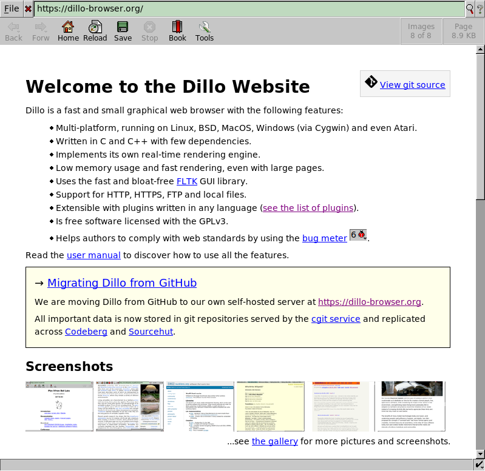

# Dillo web browser

Dillo is a multi-platform graphical web browser, known for its speed and
small footprint, that is developed with a focus on personal security and
privacy. It is built with the [FLTK 1.3 GUI toolkit](http://fltk.org).

Screenshot of the [Dillo Website][dillo] rendered in Dillo:

[dillo]: https://dillo-browser.github.io/

To install Dillo follow the [installation guide](doc/install.md).

This repository contains mostly the original code of Dillo with some
minor patches. Additional patches or pull requests are welcome.

See also other related forks: [dillo-plus][dillo-plus],
[dilloNG][dilloNG], [D+ browser][dplus-browser] and [Mobilized
Dillo][mobilized].

[dillo-plus]: https://github.com/crossbowerbt/dillo-plus
[dilloNG]: https://github.com/w00fpack/dilloNG
[dplus-browser]: https://sourceforge.net/projects/dplus-browser/
[mobilized]: https://www.toomanyatoms.com/software/mobilized_dillo.html

> [!WARNING]
> As of December 2023, the host `dillo.org` is [no longer under control][gone]
> of Dillo developers. A copy of the old website is archived in
> [GitHub Pages][old] and the [Wayback Machine (May 2022)][may].

[gone]: https://dillo-browser.github.io/dillo.org.html
[old]: https://dillo-browser.github.io/old/
[may]: http://web.archive.org/web/20220508022123/https://www.dillo.org/

